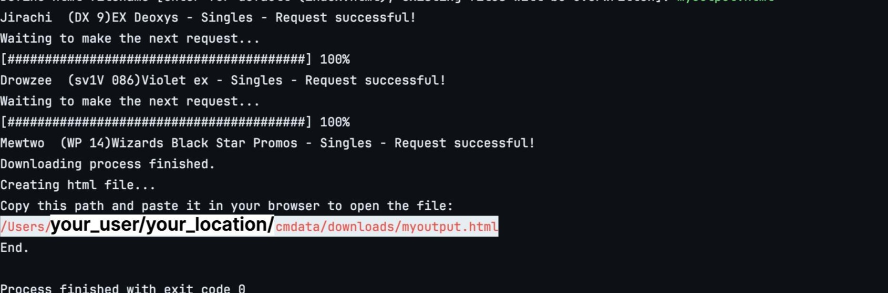

# CmData
> ⚠️ Disclaimer: This project is intended for educational and experimental purposes only. Actions performed by this code may be prohibited by the website, and unauthorized use could lead to legal consequences. Users are solely responsible for their actions and any potential legal issues that may arise from using this tool.
> 
A data extraction tool to collect information from Cardmarket.<br>
Input a txt file with the urls of the cards you need and get a HTML file with card name, image and prices.

## Python version
> This project requires **Python 3.10** or later.

## Installation and configuration
### Clone the repository
```
git clone https://github.com/lmvjack/cmdata
```
### Dependencies
#### Using pipenv
In the project directory

```
pipenv shell
pipenv install
```

#### requirements.txt
A ```requirements.txt``` file is available in the project directory and can be used with other virtual environment tools.

---
### Request headers
Request headers can be found in the ```config.py``` file. To successfully make a request, a cookie header may be necessary, although not always according to my tests. To have higher probabilities of doing a successful request, you can manually copy a cookie header from a browser and then use it for all you next requests.

Then with your favourite text editor create a **.env** file in the project directory and set the ```COOKIE``` variable.
```
COOKIE=yourcookie...
```
The cookie will be automatically added to the request headers.
### Wait time
To prevent being blocked by the website due to excessive requests, the code incorporates a delay mechanism. After each request the script pauses for a specified amount of time. <br>
You can find the variable that specifies the wait time in ```config.py```. You can change it at your own risk.
```
NEXT_REQ_WAIT_TIME = 10
```
### Input file
In the project folder create a ```.txt``` file with the urls of the cards you need, separated by a new line.
```txt
https://www.cardmarket.com/en/Pokemon/Products/Singles/EX-Deoxys/Jirachi-DX9
https://www.cardmarket.com/en/Pokemon/Products/Singles/Violet-ex/Drowzee-V2-sv1V086
https://www.cardmarket.com/en/Pokemon/.........
https://www.cardmarket.com/en/Pokemon/.........
```

## Running
Make sure to enter your virtual environment before running the program.<br>
In the project directory run the main file. You will be prompted to insert the csv input filename and the HTML output filename.
```aiignore
python3 main.py
```

Finally copy the path of the HTML filename that is displayed on your terminal at the end of the script, and paste it in a browser to see the file.



## To do
- [x] Change csv file to new line separated
- [ ] Proxy support
- [ ] HTML to PDF
